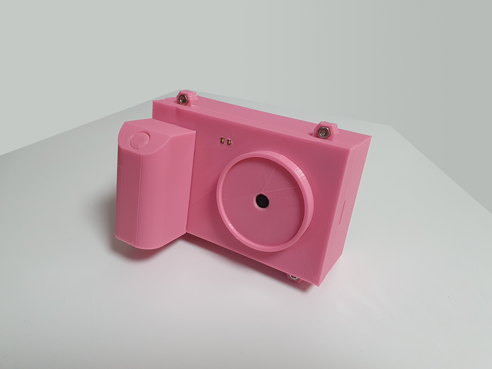
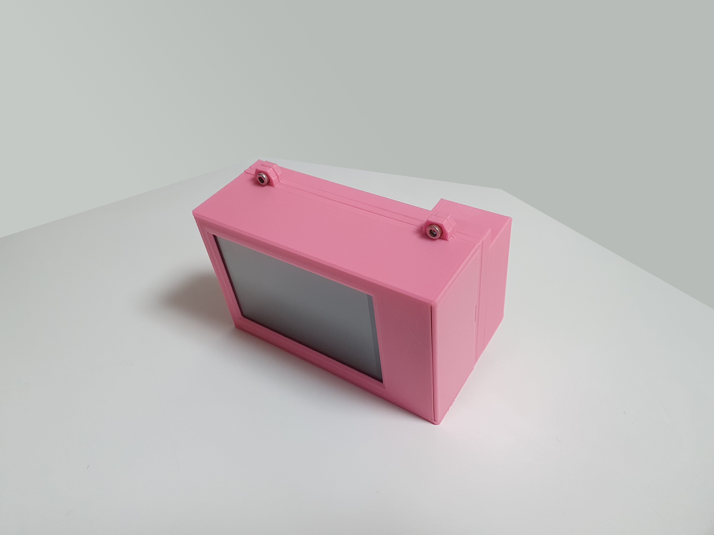
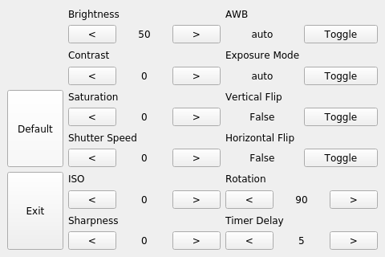
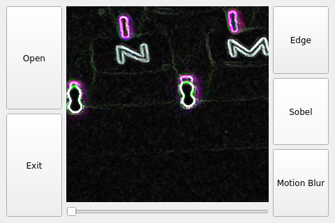
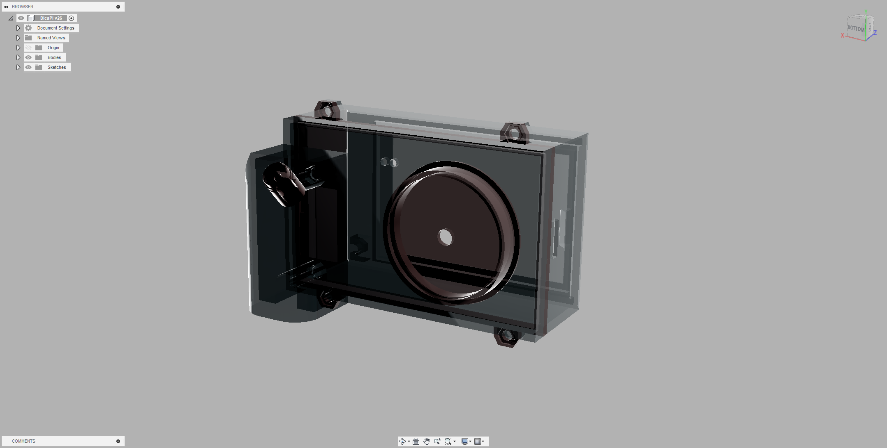
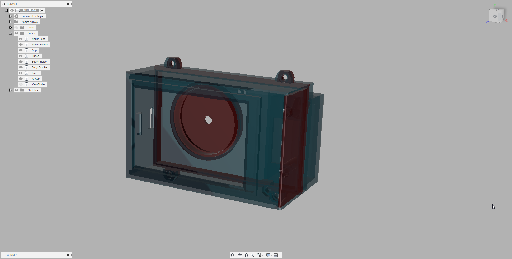

# DicaPi
### 라즈베리파이를 활용한 DIY 카메라 (DIY simple digital camera with RaspberryPi)

 

 

 

-----------------------------------------------

### 하드웨어 (Hardware)
| Name         |  Description  |
| ------------ | :-----------: |
| RPi 3B+      |       -       |
| TFT-LCD      | RPi 3.5in(a)  |
| PiCamera     |    V1 5MP     |
| BMS & LiPo   |    5000mAh    |
| LED          |   Hi x 2ea    |
| PushButton   |       -       |
| PLA Filament | Made in Korea |
| Nut & Bolt   | 5mm x 4 pair  |

-----------------------------------------------

### 특징 (Features)
| Name         |        Description         |
| ------------ | :------------------------: |
| Capture      |       Take a picture       |
| Record       |        Record video        |
| Configurator | Configure camera parameter |
| Filter       |        Some Effect         |
| Timer        |             -              |
| Flash        |             -              |
| Image View   |        Open nomacs         |

-----------------------------------------------

### 환경설정 (Configurator)

### 필터 (Filter)

-----------------------------------------------

### 케이스 (Case)
 